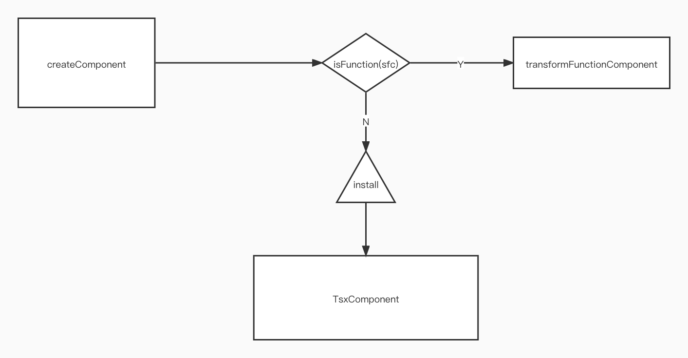

## transform-vue-js

### background

this project aims to transform vue to js, that means you can use js file to write vue. Althrough Vue official supply the [@babel/transform-vue-jsx](https://github.com/vuejs/jsx/tree/master/packages/babel-plugin-transform-vue-jsx),
but it is still for me to make another one.

this project is inspired from my company tool , vue-creator.However it is not opensourced. So I write a tool which the function is the part of it. Hope this tool can help you.

**structure**:

<p>
    
</p>


### install 


```shell

npm install transform-vue-js

```

### use

use vue-cli to create the init project; And install transform-vue-js on your project. In the init project,the components folter contains the ```HelloWordld.vue```. So you can add a test.js file and use it , like :


```js 

export default createComponent({
    render(h) {
        return (<div>test</div>)
    }
})

```

Then you add test in the router file. Hopefully , you can see the ```'test'``` on the chrome through render function.


### MIT LICENSE

